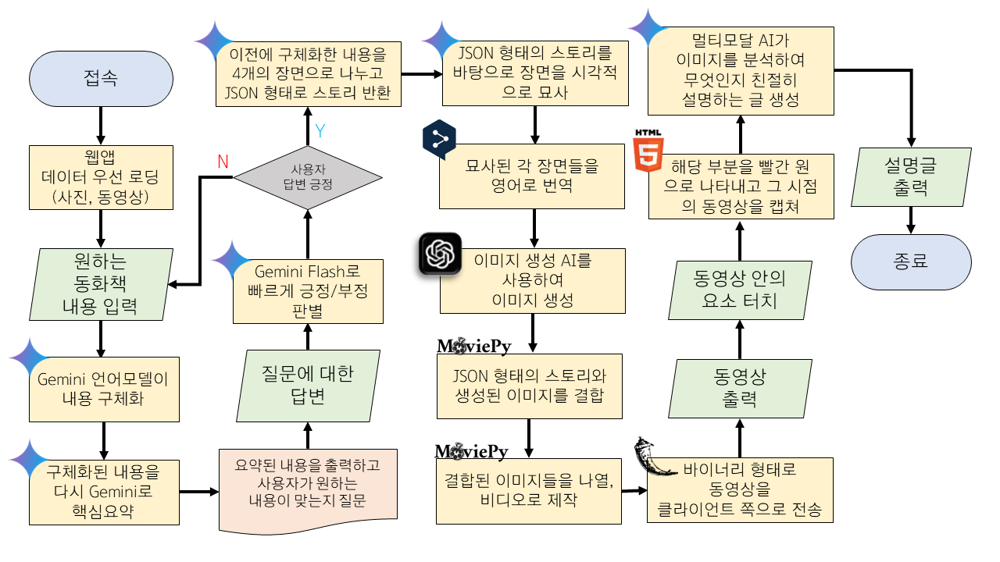
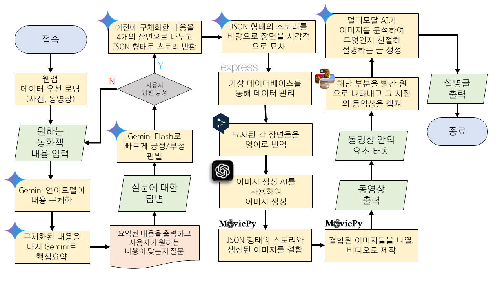

# 📸 VocabVids

유아의 창의력 및 언어·인지 기능 향상을 위한 AI 기반 동화책 동영상 생성 플랫폼

## 프로젝트 소개

-   2024 정보과제연구 2학기 개인 프로젝트 작품
-   Next.js (frontend), Node.js & Express (backend), Python & Flask (backend & gui) 사용
-   코로나19로 인한 언어 및 인지 기능 저하 문제를 해결하고자 영유아의 창의력 및 언어·인지 기능 향상을 돕는 AI 기반 동화책 생성 플렛폼 개발하고자 함.

## 데모

> 2025 3월 테스트 결과 유감스럽게도 Type2 GUI 프로그램이 정상작동 하지 않는것이 발견되었습니다. 해당 GUI 프로그램의 원본 소스코드가 손실되어, 재복구가 어려울것으로 보여지며 해당 GUI 프로그램에 대한 후속 지원은 없을 예정입니다.

> 아래 웹데모는 Type 2 - Plan 0으로 작동됩니다.

https://vocabvid.netlify.app/

### 대표 결과물 (Type 1 - Plan A)

    <video src="docs/finalOutput.mp4" width="50%" controls>

### Type 1 시연

    

### Type 2 시연

    

### Plan 0 결과물

    <video src="docs/plan0Output.mp4" width="50%" controls>

## 주요 기능

### Type 1 (전체 웹앱 방식)

    

1. 동영상 제작 프롬포트 입력/구체화 과정

    - 아이가 말하는 자신의 상상을 STT로 텍스트화
    - 텍스트화된 상상을 구글 언어모델 인공지능 Gemini Pro를 사용해 확장
    - 확장된 텍스트를 구글 언어모델 인공지능 Gemini Pro가 읽고, 요약하여 확장된 내용이 아이의 의도와 같은지 질문하는 글 생성
    - 질문을 TTS로 송출

    - 아이가 답변을 말하면 STT로 받아들이고 구글 언어모델 인공지능 Gemini Pro가 긍정의 답변인지 부정의 답변인지 확인하여 긍정일시엔 4번으로, 부정일시엔 1번으로 되먹임
    - 확장된 텍스트를 구글 언어모델 인공지능 Gemini Pro를 사용해 장면 구분이 된 동화의 형태로 변환

2. 프롬포트 바탕 동영상 생성

    - 각 장면을 Dall·E로 동화 같은 그림체로 이미지 생성
    - 파이썬을 사용해 각 이미지와 장면 텍스트를 합치고, TTS가 포함된 영상으로 변환

3. 동영상 송출 및 후처리
    - 화면에 동영상을 송출
    - 장면 송출 중 화면을 터치 시 해당 장면의 터치한 부분을 표시한 이미지와 해당 장면의 내용을 구글 언어모델 인공지능 Gemini Pro로 요약한 글을 구글 이미지인식 및 언어모델 인공지능 Gemini Pro Vision을 사용하여 해당 부분이 무엇을 뜻하는 것인지 알려주는 글을 생성, TTS로 송출

## Type 2 (부분 웹앱 방식)

    

1. 동영상 제작 프롬포트 입력/구체화 과정

    - 아이가 말하는 자신의 상상을 STT로 텍스트화
    - 텍스트화된 상상을 구글 언어모델 인공지능 Gemini Pro를 사용해 확장
    - 확장된 텍스트를 구글 언어모델 인공지능 Gemini Pro가 읽고, 요약하여 확장된 내용이 아이의 의도와 같은지 질문하는 글 생성
    - 질문을 TTS로 송출
    - 아이가 답변을 말하면 STT로 받아들이고 구글 언어모델 인공지능 Gemini Pro가 긍정의 답변인지 부정의 답변인지 확인하여 긍정일시엔 4번으로, 부정일시엔 1번으로 되먹임
    - 확장된 텍스트를 구글 언어모델 인공지능 Gemini Pro를 사용해 장면 구분이 된 동화의 형태로 변환

2. 프롬포트 바탕 동영상 생성

    - 각 장면을 Dall·E로 동화 같은 그림체로 이미지 생성
    - 파이썬을 사용해 각 이미지와 장면 텍스트를 합치고, TTS가 포함된 영상으로 변환

3. 동영상 송출 및 후처리

    - 화면에 동영상을 송출
    - 장면 송출 중 화면을 터치 시 해당 장면의 터치한 부분을 표시한 이미지와 해당 장면의 내용을 구글 언어모델 인공지능 Gemini Pro로 요약한 글을 구글 이미지인식 및 언어모델 인공지능 Gemini Pro Vision을 사용하여 해당 부분이 무엇을 뜻하는 것인지 알려주는 글을 생성, TTS로 송출

## Plan 구분 (예상 서비스 비용)

> 이미지 생성 비용(4장{동영상 1개} 기준) : Dall•E 3 - 0.14 달러(한화 약 200원), Dall•E 2 - 0.08 달러(한화 약 110원)

### Plan 0

-   HuggingFace Stable Diffusion (Serverless Inference API) 사용
-   비용이 들지 않음.

### Plan A

-   Dall•E 3 사용
    -   **Plan A-1 (일주일 약 10회, 한달 40회 제한) - 월 7,780 원**
    -   **Plan A-2 (일주일 약 50회, 한달 200회 제한) - 월 38,902 원**
    -   **Plan A-3 (일주일 약 100회, 한달 400회 제한) - 월 77,805 원**

### Plan B

-   Dall•E 2 사용
    -   **Plan B-1 (일주일 약 10회, 한달 40회 제한) - 월 4,446 원**
    -   **Plan B-2 (일주일 약 50회, 한달 200회 제한) - 월 22,230 원**
    -   **Plan B-3 (일주일 약 100회, 한달 400회 제한) - 월 44,460 원**

## 구현 중 어려웠던 점 (Type 1과 Type 2로 나뉘게된 계기)

### 문제

파이썬 호스팅 과정에서 무료 호스팅 플렛폼을 사용하다보니 메모리가 많이 필요하지 않은 단순작업들은 문제없이 실행되었지만, 동영상 편집 제작과 같은 메모리가 많이 드는 작업에서 메모리 부족이 일어났다.

### 고려 해본 해결책

1. 현재는 금전적인 문제로 백엔드 서버 호스팅을 할수는 없지만 호스팅이 되었다고 가정하고 개발 컴퓨터로 테스트 서버를 열어 잠시나마 구현하는 방법.

2. 웹앱 전체를 일반 소프트웨어 프로그램으로 변환시켜 사용자의 컴퓨터 메모리를 사용하는 방법

3. 웹앱에서 동영상 프롬포트를 만들고 해당 프롬포트를 DB에 저장, 사용자에게 키를 전달하여 사용자 컴퓨터 프로그램에 입력하면 영상이 생성되도록 하는 방법 (일부는 웹앱, 일부는 프로그램으로 구현)

### 사용한 해결책

현재 JS가 돌아가고 있는 서버에선 메모리 부족과 같은 문제가 발생하고 있지 않음으로, JS 웹앱은 유지하되 PY 백엔드 서버만 따로 GUI 프로그램으로 만들기로 결정.
(일단 진행하던대로 Python은 테스트 서버를 열어 모든 작업을 웹앱 형태로 진행하되, 추가적으로 진행)

        Type 1 - Python 백엔드 서버를 테스트 서버로 열어 전체 웹앱 방식으로 구현
        Type 2 - Python 백엔드 서버를 프로그램화 하여 웹앱 방식과 프로그램 방식을 같이 사용하여 구현

## 개발 기획서 및 프로젝트 설명서

[Vocabvids 개발 기획서](https://tionlabs.notion.site/VocabVid-d6516dd8899341e98190565110452054)

[Vocabvids 프로젝트 설명서](https://tionlabs.notion.site/VocabVids-ce57f2b40f0d4e79a9e0973068ac33cf)

## 유의 사항

Python GUI 프로그램의 원본 소스코드의 최종 원본파일이 사라져 현재 찾을수 없는 상태가 되어 초기에 테스트 용도로 사용한것으로 추정되는 버전의 소스코드로 대신 대체하였습니다.

Text AI와 Database 입출력을 담당하는 JS API 서버는 이 프로젝트를 위해 독립적으로 개발된것이 아닌 여러 프로젝트에서 같이 사용되는 공용 API로 이 프로젝트 코드만 작성되어 있는 API가 아니라서 소스코드를 공개하기 어려운 점 양해 부탁드립니다.

## 기여자

본 프로젝트는 개인 프로젝트로 기획되어, 본 프로젝트의 기획, 개발, 구현, 문서화 등 모든 작업은 Tation이 단독으로 수행하였음을 밝힙니다.

## 라이선스

이 프로젝트는 MIT 라이선스에 따라 라이선스가 부여됩니다.
자세한 내용은 LICENSE 파일을 참조하세요.
